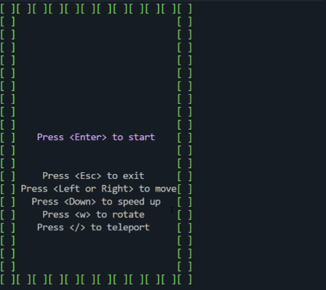
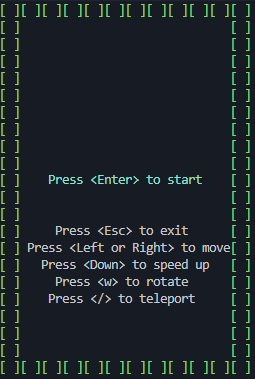
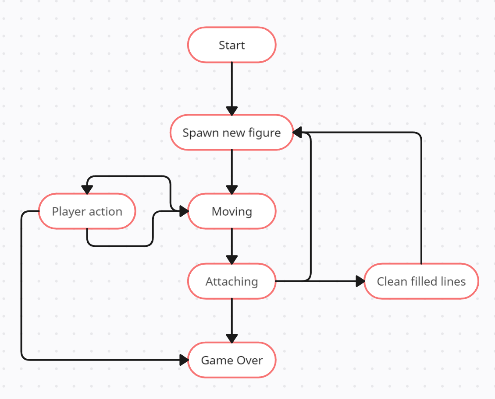

# Brick Game: Tetris

The classic Tetris game implemented in C using structural programming and finite state machines. The game consists of a library with game logic and a terminal interface built with `ncurses`.


---

## Description

- **Game Logic**: Implemented as a C library using finite state machines.
- **Interface**: Terminal (CLI) based on `ncurses`.
- **Core Features**:
  - Piece movement and rotation
  - Soft drop
  - Line clearing
  - Next piece preview
  - Score, level, and high score tracking (saved between sessions)

---

## Technical Details

- **Language**: C (C11)
- **Standard**: POSIX.1-2017
- **Code Style**: Google Style
- **Build System**: `Makefile` with main targets:
  - `make` — build the project
  - `make test` — run unit tests
  - `make gcov_report` — generate code coverage report
  - `make clean` — clean build artifacts
- **Testing**: `Check` framework
- **Coverage**: ≥ 80% for each function

---

## Project Structure

- src/brick_game/tetris/ — implementation of game logic

- src/gui/cli/ — ncurses interface

- src/tests/ — unit tests

- src/Makefile — automation of assembly and testing

- src/images/ — screenshots and gifs


---

## Controls

| Action         | Key          |
|----------------|--------------|
| Move Left      | `←`           |
| Move Right     | `→ `           |
| Speed ​​up (smoothly)      |`↓`           |
| Speed ​​up (quickly)      |`/`           |
| Rotate         | `w`          |
| Start Game     | `Enter`      |
| Pause          | `Spacebar`   |
| Quit           | `Esc`          |


---

## Requirements

- `gcc` or any C11-compatible compiler
- `make`
- `check` (unit testing framework)
- `lcov` (for coverage reports)

---

## Build and Run

```bash
make
./tetris
```
## To run unit tests
```bash
make test
```
## To generate coverage report
```bash
make gcov_report
```

## Finite State Machine Diagram
To manage the game flow and logic, the Tetris implementation relies on a finite state machine (FSM). The following diagram illustrates the structure and behavior of this FSM:

